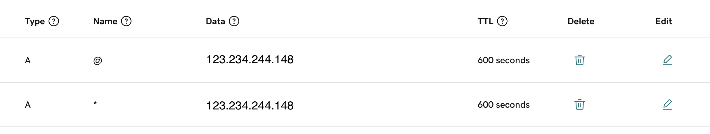

# Traefik


## Introduction

Traefik is a modern reverse proxy and load balancer designed for microservices architectures. It is built with simplicity, flexibility, and reliability in mind, making it an ideal choice for managing traffic in dynamic containerized environments. Traefik integrates seamlessly with popular orchestrators like Docker, Kubernetes, and Swarm, providing automatic service discovery and configuration updates.

## Purpose

Here we are using Traefik to:

- Expose internal applications to the internet
- Route traffic to applications based on domain
- Integrate TLS certificates to the domain
- Add authentication middleware to the application

## Pre-requisites
### Target Server

To deploy Traefik, the target server should have the following prerequisites:

- Public IP address
- Ports 80 and 443 opened
- Docker and Docker Compose installed

## Domain Provider

Before deploying Traefik, ensure the following pre-requisites are met:

- Map the parent domain to the public IP of the target server
- Map all subdomains to the public IP of the target server

    

## Deployment Steps

1. Update `setup.env` file with the following details:
   - `LETSENCRYPT_EMAIL`: Admin Email ID
   - `HOST_IP`: Public IP of the server
   - `HOST_DOMAIN`: Main parent domain

2. Run the pre-deployment script:
   ```bash
   chmod +x pre-deployment.sh
   ./pre-deployment.sh
   ```

3. Deploy Traefik using Docker Compose:
   ```bash
   docker-compose up -d
   ```

These steps will set up Traefik on your server, allowing you to manage traffic effectively and securely route requests to your applications.