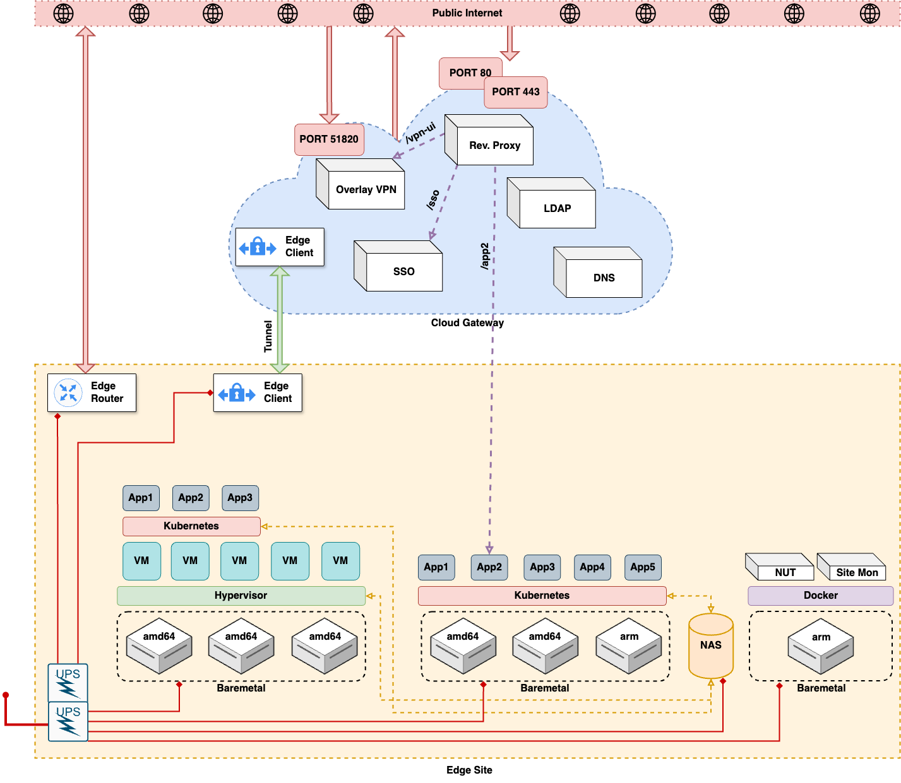
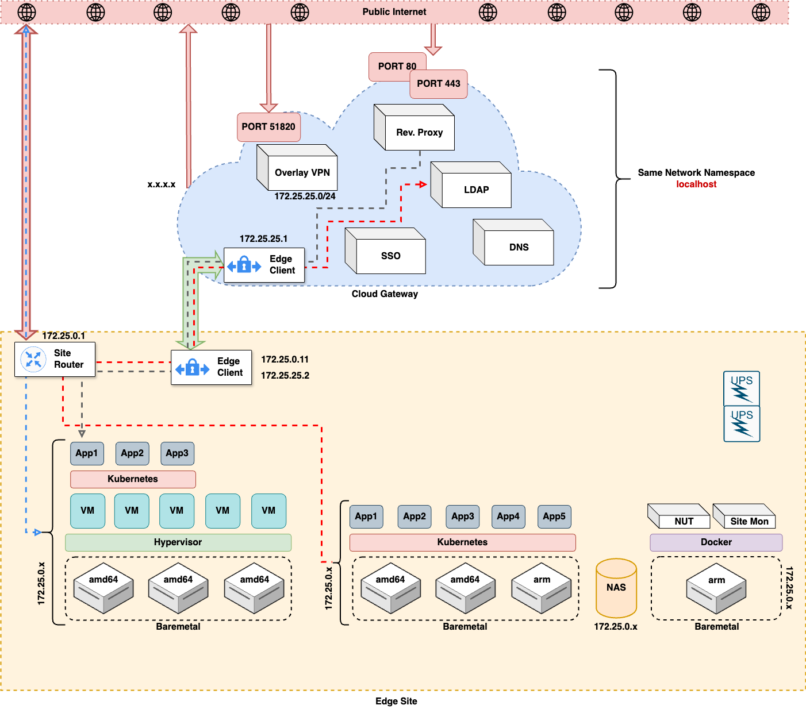
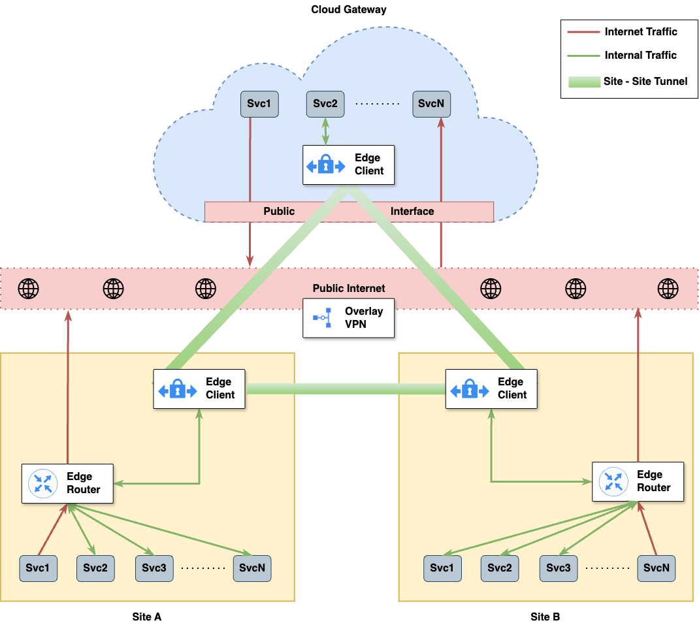
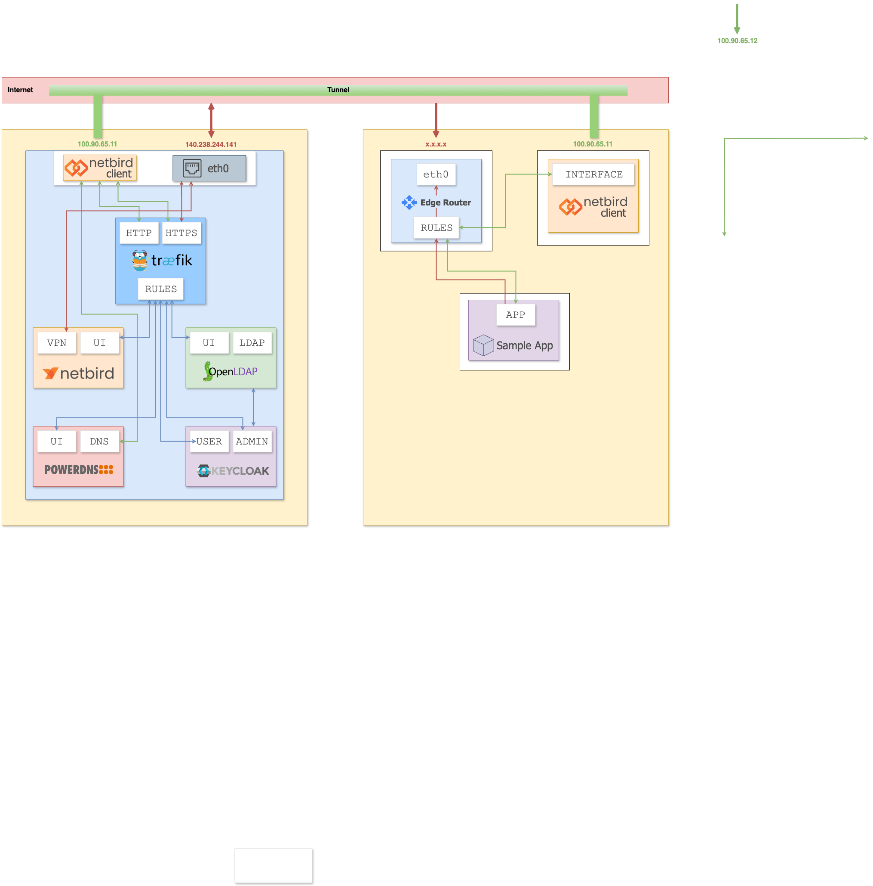

**DevOps HomeLab**

### Overview:
This repository contains the complete configuration and infrastructure setup for a self-hosted DevOps homelab environment. It includes reverse proxy routing, authentication systems, networking, monitoring, identity management, remote access, DNS, and infrastructure services.

The setup is designed to provide:

* Centralized authentication & identity management
* Secure service exposure via reverse proxy
* Infrastructure monitoring & observability
* Private networking & connectivity
* Remote access services
* Edge + cloud gateway architecture
* Containerized deployments (Docker-based)

### Architecture Components

#### Reverse Proxy & Routing

* **Traefik** - Core reverse proxy, routing, TLS termination, and service exposure
* **Nginx Proxy** - Additional proxy handling and upstream routing

#### Authentication & Identity

* **Authentik** - Identity provider and authentication gateway
* **Keycloak** - Identity and access management with custom themes
* **OpenLDAP** - Directory services for centralized user management
* **OIDC Forward Auth** - Authentication middleware for protected services

#### Networking & Connectivity

* **NetBird** - Secure private networking (WireGuard-based mesh VPN)
* **Netmaker** - Virtual overlay network management
* **Edge Gateway (Node / Router)** - Edge routing and gateway infrastructure
* **Kloudbeams Connect** - Custom connectivity service

#### Remote Access & Infrastructure

* **Apache Guacamole** - Clientless remote desktop gateway
* **rdesktop** - Remote desktop access
* **Proxmox Integration** - Virtualization platform monitoring and access

#### Monitoring & Observability

* **Prometheus** - Metrics collection and monitoring
* **Grafana Dashboards** - Visualization and observability dashboards
* **Cloud Gateway Monitoring** - Downstream monitoring pipeline
* **Edge Monitoring Stack** - Edge infrastructure metrics
* **PVE Exporter** - Proxmox metrics exporter
* **Speedtest Tracker** - Network performance monitoring

#### Infrastructure & Management Tools

* **Portainer** - Container management UI
* **Portainer Agent** - Distributed container management
* **Homepage Dashboard** - Central service dashboard

#### DNS & Network Services

* **Pi-hole** - Network-wide ad blocking and DNS filtering
* **PowerDNS** - Authoritative DNS service

#### Power & Hardware Management

* **NUT Server** - UPS monitoring and power management
* **UPSnap** - Wake-on-LAN management

### Architecture

### Physical Network Communication

### Virtual Network Communication

### Logical Communication

### Service Communication

### License:
DevOpsLab Lab is licensed under the [MIT License](LICENSE.md). Please review the license file for more details.
